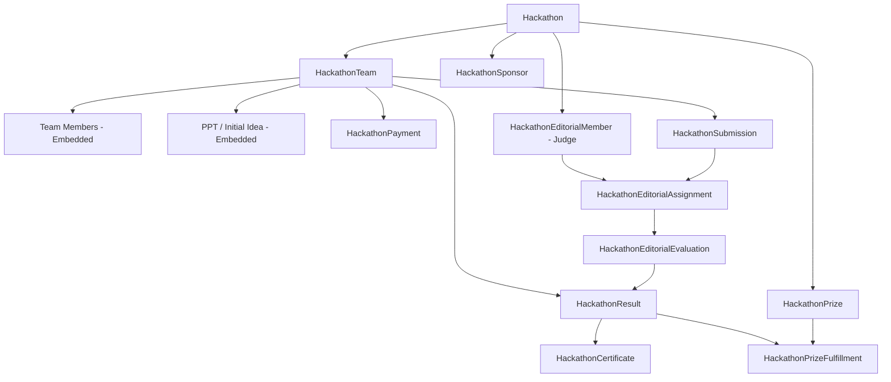

# Multi-Hackathon Architecture Audit — Phase M1

> **Document Classification**: Architecture Audit & Migration Readiness Assessment  
> **Status**: Complete — Audit Only (Zero Code/DB Modifications)  
> **Target Release**: Code-A-Nova Dynamic Multi-Hackathon Platform  
> **Scope**: Backend, Frontend, Database, Identity Architecture, Routing, and Security

---

## 1. Current Architecture Overview

The Code-A-Nova Hackathon platform was originally engineered through Phases 1–9 as a cohesive, production-ready system to host a single premier annual event: **Code-A-Nova National Hackathon 2026**.

The operational ecosystem currently comprises:
1. **Public Participant Portal** (`/hackathon`): Informational landing page, tracks, timeline, prizes, FAQs, team status viewer, PPT submission links, and live countdown.
2. **Participant Workflow & Auth** (`/api/hackathon/*`): Reuses the platform's global student/user JWT authentication (`User` model) to let students check their team status, complete ₹49 team confirmation payments via Razorpay, save draft project submissions, and make final submissions before the deadline.
3. **Admin Management Workspace** (`/admin-dashboard` under the Hackathon tab): Unified administrative control panel featuring Overview analytics, Team Directory & Manual CRUD, Unstop Excel Multi-Step Importer, Submission Auditing & Unlocking, Editorial Judge Management & Assignments, Automated Scoring & Tie-breaking, Verifiable Certificate Generation & Bulk Emailing, Prize Fulfillment Tracking, System Diagnostics, Operational Search, Team 360° inspector, and Duplicate Queue Resolution.
4. **Judge / Editorial Workspace** (`/editorial`, `/hackathon/editorial`): Isolated portal with dedicated credentials for external judges to review assigned team projects, launch project links with security auditing, score against 5 weighted criteria, and submit binding evaluations.
5. **Public Verification & Showcase**:
   - `/hackathon/results`: Live leaderboard, winners list, track filtering, and team certificates.
   - `/hackathon/certificate/verify/:verificationCode`: Verifiable certificate portal with QR authentication and printable HTML certificates.

Across this entire system, the platform operates on an implicit singleton paradigm: all models, controllers, services, and frontend state assume that there is only one hackathon happening at any given time, default-scoped to `"can-hackathon-2026"`.

---

## 2. Current Single-Hackathon Assumptions

Across the full stack, the application embeds deep architectural assumptions of a single hackathon:

1. **Singleton Settings Model**:
   - `HackathonSetting.getOrCreateSettings(hackathonId = 'can-hackathon-2026')` defaults to the 2026 hackathon. If queried without arguments, or if the specified ID is not found, it falls back to `this.findOne()` (returning the first document in the collection), treating settings as a singleton instance.
2. **Hardcoded Fallbacks in Controllers & Services**:
   - In `hackathonController.js`: over 35 distinct controller functions declare `const hackathonId = req.query.hackathonId || req.body.hackathonId || 'can-hackathon-2026'`.
   - In `hackathonResultService.js`, `hackathonOpsService.js`, and `hackathonCertificateService.js`: methods default their `hackathonId` argument to `'can-hackathon-2026'`.
3. **Hardcoded Case Inconsistency in Payments**:
   - `HackathonPayment.js` defaults its `hackathonId` to `'CAN-HACK-2026'` (uppercase), whereas `HackathonSetting`, `HackathonTeam`, and others default to `'can-hackathon-2026'` (lowercase).
4. **Unscoped Team Queries in Participant Auth**:
   - In `resolveParticipantTeam(req)` (`hackathonController.js:150-161`), the query finds the user's team by `leader.userId`, `members.userId`, `leader.email`, or `members.email` **without any `hackathonId` filter**. If a participant participated in 2026 and registers for 2027, the system returns whichever team MongoDB indexes first.
5. **Unscoped Duplicate Detection in Unstop Imports**:
   - In `unstopParserService.js:585-590`, the parser queries `HackathonTeam.find({ $or: [ { unstopApplicationId: ... }, { 'leader.email': ... } ] })` across the entire database without restricting to `hackathonId`. Any student or team participating in multiple hackathons would be falsely flagged as a duplicate.
6. **Unscoped Identity Resolution**:
   - In `hackathonIdentityService.js:137-180`, lookups for existing teams by Unstop ID, Website Registration ID, or Leader Email do not filter by `hackathonId`.
7. **Hardcoded Judge Login**:
   - In `hackathonController.js:3581-3584`, `editorialLogin` executes:
     ```javascript
     const member = await HackathonEditorialMember.findOne({
       email: email.toLowerCase().trim(),
       hackathonId: 'can-hackathon-2026',
     }).select('+passwordHash');
     ```
     Judges provisioned for any other hackathon cannot log in.
8. **Frontend Query Assumption**:
   - `HackathonPortal.jsx` calls `/api/hackathon/info`, `/api/hackathon/my-team`, `/api/hackathon/submission/my-submission`, `/api/hackathon/public/results`, and `/api/hackathon/public/sponsors` without passing a hackathon slug or ID.
   - `HackathonAdminWorkspace.jsx` renders tabs that dispatch hardcoded `{ hackathonId: "can-hackathon-2026" }` payloads on recalculate, certificate generation, tie-breaking, and export operations.
9. **Single Active Toggle**:
   - `toggleHackathonActive` toggles `isActive` on the single `HackathonSetting` document, with no concept of multiple hackathons, life-cycle statuses (`DRAFT`, `UPCOMING`, `ACTIVE`, `COMPLETED`, `ARCHIVED`), or concurrency safety preventing multiple active hackathons.

---

## 3. Existing Hackathon Model & Settings Analysis

### Current Schema: `HackathonSetting.js`
There is currently **no top-level `Hackathon` model**. The entire concept of a hackathon is conflated with its configuration schema:

- **Collection**: `hackathonsettings` (currently contains 3 records in MongoDB).
- **Core Fields**:
  - `hackathonId`: String, default `'can-hackathon-2026'`, unique.
  - `name`: String, default `'Code-A-Nova National Hackathon 2026'`.
  - `tagline`, `description`.
  - `startDate`, `endDate`, `submissionDeadline`, `resultDate`.
  - `participationFee` (default `49`), `currency` (`INR`).
  - `whatsAppLink`: Exposed only to paid/confirmed teams.
  - `rules`: Array of strings.
  - `tracks`: Array of subdocuments `{ trackId, name, description, icon, isActive }`.
  - `judgingCriteria`: Array of `{ criteriaId, name, description, weight, maxScore }`.
  - `prizes`: Embedded array of award categories.
  - `announcements`: Array of `{ id, title, content, type, active, createdAt }`.
  - `isRegistrationOpen`, `isSubmissionOpen`, `isResultsPublished`.
  - `isActive`: Boolean flag controlling visibility on the dashboard.

### Architectural Shortcomings
1. **Lack of Lifecycle Separation**: It blends hackathon identity (ID, slug, title) with settings and state flags. A hackathon cannot transition through formal states (`DRAFT` → `UPCOMING` → `ACTIVE` → `COMPLETED` → `ARCHIVED`).
2. **Fallback Leak**: `getOrCreateSettings` executes `if (!settings) settings = await this.findOne();`. When creating a second hackathon, any service calling this method without an exact matching ID receives the first hackathon's configuration.
3. **No Slugs**: URLs cannot reference friendly identifiers like `/hackathon/code-a-nova-2026` or `/hackathon/ai-sprint-2027`.

---

## 4. Existing Team Identity Architecture Verification

### Audit of Canonical Internal Team ID
A rigorous audit was conducted on the Team Identity Architecture:

```
                  ┌─────────────────────────────────────────────────┐
                  │            CANONICAL TEAM IDENTITY              │
                  │             CAN-TEAM-XXXXXX                     │
                  │   (Permanent, Immutable, Unique, System-Gen)    │
                  └───────────────────────┬─────────────────────────┘
                                          │
                  ┌───────────────────────┴─────────────────────────┐
                  ▼                                                 ▼
      ┌───────────────────────┐                         ┌───────────────────────┐
      │ SOURCE REFERENCE 1    │                         │ SOURCE REFERENCE 2    │
      │ Website Registration  │                         │ Unstop Application    │
      │ CN-12121 / Direct     │                         │ App ID: 232323        │
      └───────────────────────┘                         └───────────────────────┘
```

1. **Canonical Identity Invariant**:
   - Verified: The canonical identifier is `HackathonTeam.teamId` (formatted as `CAN-TEAM-XXXXXX`).
   - Generation: Implemented in `hackathonIdentityService.js:generateInternalTeamId()`.
   - Sequential format: `CAN-TEAM-000001`, `CAN-TEAM-000002` using collection-level counter and collision avoidance loop.
2. **Source References as Metadata Only**:
   - `HackathonTeam.sourceReferences.websiteRegistrationIds`: Array of strings.
   - `HackathonTeam.sourceReferences.unstopTeamIds`: Array of strings.
   - Verified: These are strictly secondary reference arrays and are NOT used as primary foreign keys by downstream entities.
3. **Downstream Entity Relationship Check**:
   - `HackathonSubmission`: References `teamId: String` (canonical) and `team: ObjectId`.
   - `HackathonPayment`: References `teamId: String` (canonical).
   - `HackathonEditorialAssignment`: References `teamId: String` (canonical) and `team: ObjectId`.
   - `HackathonEditorialEvaluation`: References `teamId: String` (canonical) and `team: ObjectId`.
   - `HackathonResult`: References `teamId: String` (canonical) and `team: ObjectId`.
   - `HackathonCertificate`: References `teamId: String` (canonical) and `team: ObjectId`.
   - `HackathonPrizeFulfillment`: References `teamId: String` (canonical) and `team: ObjectId`.
   - `HackathonDuplicateQueue`: References `candidateMatches.teamId` (canonical).
4. **Current Inconsistency Discovered**:
   - In `hackathonIdentityService.js`, `calculateMemberOverlap` and duplicate resolvers search across `HackathonTeam` **without scoping by `hackathonId`**.
   - If Team "Alpha" with Leader Email `user@example.com` enters Hackathon A, and enters Hackathon B next year with the same email, the current identity resolution engine flags them as a duplicate or attempts to merge them into Hackathon A's team!
   - **Resolution Required in Phase M2/M4**: All team identity resolution queries must be scoped by `{ hackathonId, ... }`.

---

## 5. Data Relationship & Dependency Audit

Below is the complete entity dependency map and scoping audit:



### Entity-by-Entity Attribute Analysis

| Entity | Model File | Existing `hackathonId`? | Enforced in Queries? | Uniqueness Constraints | Data Leakage Risk |
| :--- | :--- | :--- | :--- | :--- | :--- |
| **Hackathon / Settings** | `HackathonSetting.js` | Yes (`'can-hackathon-2026'`) | No (falls back to singleton `findOne()`) | `hackathonId: unique` | **High**: Fallback returns wrong hackathon |
| **Team** | `HackathonTeam.js` | Yes (`'can-hackathon-2026'`) | **No**: `resolveParticipantTeam` & Unstop queries unscoped | `teamId: unique` (global) | **Critical**: Participants see previous year's teams |
| **Members** | Embedded in `HackathonTeam` | Inherited from Team | **No**: Unscoped email search | None | **Critical**: Student cannot lead two teams across hackathons |
| **PPT / Idea** | Embedded in `HackathonTeam` | Inherited from Team | Scoped via Team | None | None |
| **Payment** | `HackathonPayment.js` | Yes (`'CAN-HACK-2026'`) | Partially | `orderId: unique` (global) | **Medium**: Case mismatch (`CAN-HACK-2026` vs lowercase) |
| **Submission** | `HackathonSubmission.js` | Yes (`'can-hackathon-2026'`) | **No**: Queries use `teamId` or `team._id` only | None (No compound uniqueness) | **High**: Duplicate submissions possible if IDs reuse |
| **Judge** | `HackathonEditorialMember.js` | Yes (`'can-hackathon-2026'`) | **No**: `editorialLogin` hardcodes `'can-hackathon-2026'` | `{ hackathonId: 1, email: 1 }` (unique) | **Critical**: Judge cannot log in to other hackathons |
| **Assignment** | `HackathonEditorialAssignment.js`| Yes (`'can-hackathon-2026'`) | Yes | Partial unique: `{ hackathonId, team, editorialMember }` | Low |
| **Evaluation** | `HackathonEditorialEvaluation.js`| Yes (`'can-hackathon-2026'`) | Yes | Compound unique: `{ hackathonId, team, editorialMember }` | Low |
| **Result** | `HackathonResult.js` | Yes (`'can-hackathon-2026'`) | Yes | Compound unique: `{ hackathonId, teamId }` | Low |
| **Certificate** | `HackathonCertificate.js` | Yes (`'can-hackathon-2026'`) | Yes | Compound unique: `{ hackathonId, recipientEmail, type, version }` | Low (Global unique on code allows universal verify) |
| **Prize** | `HackathonPrize.js` | Yes (`'can-hackathon-2026'`) | Partially | `prizeId: unique` (global) | **Medium**: Cannot reuse `prizeId` like `FIRST_PRIZE` |
| **Sponsor** | `HackathonSponsor.js` | Yes (`'can-hackathon-2026'`) | Partially | `sponsorId: unique` (global) | **Medium**: Cannot reuse sponsor ID across events |
| **Fulfillment** | `HackathonPrizeFulfillment.js` | Yes (`'can-hackathon-2026'`) | Yes | Compound unique: `{ hackathonId, teamId, prizeId }` | Low |
| **Audit Log** | `HackathonAuditLog.js` | **NO (Completely Missing)** | **No** | None | **Critical**: Logs mixed across all events |
| **Duplicate Queue**| `HackathonDuplicateQueue.js` | Yes (`'can-hackathon-2026'`) | Partially | `queueId: unique` (global) | **Medium**: Cross-hackathon false positives |

---

## 6. Student Reuse Audit

### Objective
Determine whether the current architecture supports:
$$\text{Same Student} \longrightarrow \text{Hackathon A (2026)} \quad \text{and} \quad \text{Hackathon B (2027)}$$
without copying or leaking Hackathon A's operational data (payment status, PPT, submission, evaluations, certificates).

### Findings
1. **User Identity is Already Global**:
   - `User.js` acts as the platform-wide identity store (email, password hash, mobile, college, profile details).
   - No hackathon-specific operational data is stored on `User.js`.
2. **Participation is Team-Embedded**:
   - Participation is established by embedding the user's `userId` and `email` inside `HackathonTeam.leader` and `HackathonTeam.members`.
   - This design cleanly allows the same user `_id` to exist in multiple `HackathonTeam` documents across different hackathons.
3. **The Blocking Vulnerability: Unscoped Queries**:
   - In `resolveParticipantTeam(req)` (`BACKEND/controllers/hackathonController.js:150-161`):
     ```javascript
     const query = {
       isDeleted: { $ne: true },
       $or: [],
     };
     if (userId) query.$or.push({ 'leader.userId': userId }, { 'members.userId': userId });
     if (userEmail) query.$or.push({ 'leader.email': userEmail }, { 'members.email': userEmail });
     team = await HackathonTeam.findOne(query);
     ```
   - Because `query` does not filter by `hackathonId`, when a user visits `/hackathon/my-team`, MongoDB will return whichever team was created first. If the student participates in Hackathon 2026 and then visits Hackathon 2027, their 2026 team will be returned.
4. **Duplicate Detection Collision**:
   - If the student attempts to register for Hackathon 2027 or is imported via Unstop, `unstopParserService.js` will find the 2026 record and flag the 2027 entry as a `DUPLICATE`.
5. **Verdict**:
   - **Schema Feasibility**: Excellent (User model is already decoupled).
   - **Operational Blockers**: Must add `hackathonId` scoping to `resolveParticipantTeam`, `unstopParserService`, and `hackathonIdentityService`.

---

## 7. Judge Reuse Audit

### Objective
Determine whether the current architecture supports:
$$\text{Same Judge} \longrightarrow \text{Hackathon A} \quad \text{and} \quad \text{Hackathon B}$$
with independent assignments, evaluations, scores, and comments.

### Findings
1. **Per-Hackathon Judge Accounts**:
   - Currently, `HackathonEditorialMember` models an editorial judge with an embedded `passwordHash`, `email`, and `hackathonId`.
   - Index: `{ hackathonId: 1, email: 1 }` with `{ unique: true }`.
   - This compound index **already allows** the same judge email to exist in multiple hackathons.
2. **Assignments & Evaluations Are Fully Partitioned**:
   - `HackathonEditorialAssignment` has a compound partial unique index on `{ hackathonId: 1, team: 1, editorialMember: 1 }`.
   - `HackathonEditorialEvaluation` has a compound unique index on `{ hackathonId: 1, team: 1, editorialMember: 1 }`.
   - Scores, feedback, criteria evaluations, and link click audits are completely isolated per hackathon.
3. **The Blocking Vulnerabilities**:
   - **Hardcoded Login**: `editorialLogin` queries `{ email, hackathonId: 'can-hackathon-2026' }`. If Judge Jane is created for Hackathon B, she cannot log in because the controller rejects any hackathon other than 2026.
   - **Credential Duplication**: If the same person judges both events, they must have two separate accounts and passwords.
4. **Verdict**:
   - Data isolation is already preserved.
   - Authentication must support selecting or resolving the active hackathon or passing a hackathon context on login.

---

## 8. Active Hackathon Audit

### Current Mechanism
- The system currently checks `HackathonSetting.isActive`.
- In `hackathonController.js:toggleHackathonActive`:
  - It retrieves settings via `HackathonSetting.getOrCreateSettings()`.
  - Flips `settings.isActive = !settings.isActive`.
  - There is no platform-wide governor ensuring that only one hackathon is active.

### Live Telemetry from Database
A read-only inspection of the active database revealed:
- `hackathonsettings` collection currently has **3 documents**.
- **All 3 documents have `isActive: true` simultaneously**:
  1. `can-hackathon-2026`: `isActive: true`
  2. `can-hackathon-2026-p7-test`: `isActive: true`
  3. `test-phase8-1788528746277`: `isActive: true`

### Requirement
$$\text{MAXIMUM ACTIVE HACKATHONS} = 1$$
Unlimited `DRAFT`, `UPCOMING`, `COMPLETED`, `ARCHIVED` hackathons are permitted, but **at most ONE** hackathon can have `status: 'ACTIVE'` at any point in time.

### Needed Architectural Change
1. Introduce a formal top-level `Hackathon` model with status enum: `['DRAFT', 'UPCOMING', 'ACTIVE', 'COMPLETED', 'ARCHIVED']`.
2. Enforce a MongoDB partial unique index or transactional pre-save hook:
   - Only 1 document may have `status: 'ACTIVE'`.
   - Activating Hackathon B must atomically deactivate or mark previous active hackathons as `COMPLETED` or `ARCHIVED`.

---

## 9. Routing Audit

### Current Routes

#### Frontend
- `/hackathon` $\longrightarrow$ `HackathonPortal.jsx`
- `/hackathon/*` $\longrightarrow$ `HackathonPortal.jsx`
- `/hackathon/results` $\longrightarrow$ `PublicResultsPage.jsx`
- `/hackathon/certificate/verify/:verificationCode` $\longrightarrow$ `PublicCertificateVerificationPage.jsx`
- `/hackathon/verify/:verificationCode` $\longrightarrow$ `PublicCertificateVerificationPage.jsx`
- `/hackathon/editorial` $\longrightarrow$ `EditorialDashboard.jsx`
- `/hackathon/editorial/login` $\longrightarrow$ `EditorialLogin.jsx`

#### Backend
All endpoints are mounted at `/api/hackathon/*` in `BACKEND/index.js:77`:
```javascript
app.use('/api/hackathon', hackathonRoutes);
```
None of the route paths in `BACKEND/routes/hackathon.js` accept `:hackathonId` or `:slug`.

### Target Dynamic Routing Strategy
1. **Dynamic Active Resolution on Base Route**:
   - `/hackathon` dynamically resolves to the single currently `ACTIVE` hackathon.
   - If no hackathon is `ACTIVE`, renders an empty/upcoming state or archives explorer.
2. **Explicit Slug-Based Routing**:
   - `/hackathon/:slug` $\longrightarrow$ loads specific hackathon by slug.
   - `/hackathon/:slug/results` $\longrightarrow$ loads results for `:slug`.
   - `/hackathon/:slug/certificate/verify/:verificationCode` $\longrightarrow$ verifies certificate for `:slug`.
   - `/hackathon/:slug/editorial` $\longrightarrow$ judge workspace for `:slug`.
3. **Backward Compatibility Guarantee**:
   - Existing physical QR codes printed with `/hackathon/certificate/verify/CAN-CERT-2026-000001` or `/verify/:code` must continue to work globally without requiring a slug prefix.
4. **Backend Route Design Feasibility**:
   - Middleware `resolveHackathonContext`:
     - Checks `req.params.slug` or `req.headers['x-hackathon-id']` or `req.query.hackathonId`.
     - Defaults to the currently `ACTIVE` hackathon if none specified.
     - Attaches `req.hackathon` and `req.hackathonId` to all downstream route handlers.

---

## 10. Existing Data Audit

### Live Database Inventory (Telemetry gathered Sep 5, 2026)

| Collection | Model Name | Record Count | Notes / Status |
| :--- | :--- | :--- | :--- |
| `hackathonsettings` | `HackathonSetting` | **3** | 1 production (`can-hackathon-2026`) + 2 test artifacts |
| `hackathonteams` | `HackathonTeam` | **30** | 14 in `can-hackathon-2026`, 16 in test IDs |
| `hackathonsubmissions`| `HackathonSubmission` | **15** | Submissions for Phase 5 |
| `hackathonpayments` | `HackathonPayment` | **14** | Payment records from Phase 4 |
| `hackathoneditorialmembers` | `HackathonEditorialMember` | **9** | Editorial judges from Phase 6 |
| `hackathoneditorialassignments`| `HackathonEditorialAssignment` | **10** | Judge assignments |
| `hackathoneditorialevaluations`| `HackathonEditorialEvaluation` | **13** | Judge evaluations |
| `hackathonresults` | `HackathonResult` | **30** | Computed results & rankings |
| `hackathoncertificates` | `HackathonCertificate` | **57** | Issued participant & winner certs |
| `hackathonprizes` | `HackathonPrize` | **12** | Prize categories |
| `hackathonsponsors` | `HackathonSponsor` | **5** | Title & Community sponsors |
| `hackathonprizefulfillments` | `HackathonPrizeFulfillment` | **5** | Prize fulfillment tracking |
| `hackathonauditlogs` | `HackathonAuditLog` | **618** | **0 of 618 have `hackathonId`!** |
| `hackathonduplicatequeues` | `HackathonDuplicateQueue` | **0** | Empty queue |

### Migration Impact
- **Total Existing Records**: 821 records across 14 collections.
- **Audit Logs Missing `hackathonId`**: 618 records must be safely backfilled with `'can-hackathon-2026'`.
- **Legacy Teams**: Teams created prior to Phase 10 have IDs like `CAN-T1-1034`. All 30 teams have `hackathonId` populated.
- **Payments**: Check for lowercase `'can-hackathon-2026'` vs uppercase `'CAN-HACK-2026'`.

---

## 11. All Affected Models (Inventory & Field Changes Required)

### 1. `Hackathon.js` [NEW MODEL REQUIRED IN PHASE M2]
- Will represent the top-level hackathon entity.
- Fields: `hackathonId` (slug-safe key), `slug` (URL-friendly, unique), `name`, `title`, `status` (`DRAFT`, `UPCOMING`, `ACTIVE`, `COMPLETED`, `ARCHIVED`), `startDate`, `endDate`, `submissionDeadline`, `resultDate`, `settingsRef`, `createdAdminId`.

### 2. `HackathonSetting.js` [MODIFICATIONS REQUIRED]
- Decouple singleton logic: remove `getOrCreateSettings` fallback to `findOne()`.
- Reference parent `hackathonId` strictly as a foreign key.
- Index: `{ hackathonId: 1 }` (unique).

### 3. `HackathonTeam.js` [MODIFICATIONS REQUIRED]
- Add compound indexes:
  - `{ hackathonId: 1, 'leader.email': 1 }`
  - `{ hackathonId: 1, 'members.email': 1 }`
  - `{ hackathonId: 1, 'sourceReferences.unstopTeamIds': 1 }`
  - `{ hackathonId: 1, 'sourceReferences.websiteRegistrationIds': 1 }`
  - `{ hackathonId: 1, teamName: 1 }`

### 4. `HackathonSubmission.js` [MODIFICATIONS REQUIRED]
- Add compound unique index: `{ hackathonId: 1, teamId: 1 }`.
- Ensure queries check `{ hackathonId, teamId }`.

### 5. `HackathonPayment.js` [MODIFICATIONS REQUIRED]
- Harmonize default `hackathonId`: convert `'CAN-HACK-2026'` to canonical lowercase slug `'can-hackathon-2026'`.
- Add compound index: `{ hackathonId: 1, teamId: 1 }`.

### 6. `HackathonEditorialMember.js` [MODIFICATIONS REQUIRED]
- Maintain compound unique index `{ hackathonId: 1, email: 1 }`.
- Add optional `isGlobalJudge` flag or link to unified user if global credentials are required in future phases.

### 7. `HackathonEditorialAssignment.js` [VERIFIED]
- Already properly partitioned with `{ hackathonId: 1, team: 1, editorialMember: 1 }`.

### 8. `HackathonEditorialEvaluation.js` [VERIFIED]
- Already properly partitioned with `{ hackathonId: 1, team: 1, editorialMember: 1 }`.

### 9. `HackathonResult.js` [VERIFIED]
- Already has `{ hackathonId: 1, teamId: 1 }` unique constraint.

### 10. `HackathonCertificate.js` [VERIFIED]
- Already has `{ hackathonId: 1, recipientEmail: 1, type: 1, version: 1 }` unique index. Global uniqueness on `verificationCode` allows universal verification across all hackathons.

### 11. `HackathonPrize.js` [MODIFICATIONS REQUIRED]
- Change `prizeId` from globally unique to compound unique: `{ hackathonId: 1, prizeId: 1 }`.

### 12. `HackathonSponsor.js` [MODIFICATIONS REQUIRED]
- Change `sponsorId` from globally unique to compound unique: `{ hackathonId: 1, sponsorId: 1 }`.

### 13. `HackathonPrizeFulfillment.js` [VERIFIED]
- Already has `{ hackathonId: 1, teamId: 1, prizeId: 1 }` unique constraint.

### 14. `HackathonAuditLog.js` [CRITICAL MODIFICATION REQUIRED]
- Add field: `hackathonId: { type: String, trim: true, default: null, index: true }`.
- Add compound index: `{ hackathonId: 1, createdAt: -1 }`.
- Update `HackathonAuditLog.log()` static method to accept `hackathonId`.

### 15. `HackathonDuplicateQueue.js` [MODIFICATIONS REQUIRED]
- Ensure duplicate queue queries and candidate match evaluation are strictly scoped by `hackathonId`.

---

## 12. All Affected Backend Files

| File Path | Role / Functionality | Specific Areas Affected |
| :--- | :--- | :--- |
| `BACKEND/models/HackathonSetting.js` | Settings schema & statics | Remove singleton `findOne()` fallback in `getOrCreateSettings` |
| `BACKEND/models/HackathonTeam.js` | Team schema & indexes | Add compound indexes with `hackathonId` |
| `BACKEND/models/HackathonAuditLog.js` | System audit trail | Add `hackathonId` attribute, logging helper parameter, and compound index |
| `BACKEND/models/HackathonPrize.js` | Prize catalog | Scoped index `{ hackathonId: 1, prizeId: 1 }` |
| `BACKEND/models/HackathonSponsor.js` | Sponsor catalog | Scoped index `{ hackathonId: 1, sponsorId: 1 }` |
| `BACKEND/models/HackathonPayment.js` | Payment records | Fix default `hackathonId` casing |
| `BACKEND/controllers/hackathonController.js` | Primary controller (6,777 lines) | Over 40 methods need dynamic hackathon context instead of hardcoded fallbacks; fix `editorialLogin` |
| `BACKEND/routes/hackathon.js` | Route declarations | Add context resolution middleware; support `:slug` parameter |
| `BACKEND/services/hackathonIdentityService.js`| Team canonical ID & resolution | Scope Unstop/Website/Email matching to target `hackathonId` |
| `BACKEND/services/unstopParserService.js` | Excel importer & deduplicator | Scope existing team lookups to `hackathonId` |
| `BACKEND/services/hackathonOpsService.js` | System health & search | Remove `'can-hackathon-2026'` defaults; scope health metrics |
| `BACKEND/services/hackathonResultService.js` | Results calculation engine | Remove `'can-hackathon-2026'` fallbacks; calculate per active hackathon |
| `BACKEND/services/hackathonCertificateService.js`| Certificate generation | Dynamic hackathon names and dates in certificate templates |
| `BACKEND/services/hackathonEmailService.js` | Email notifications | Replace hardcoded "Code-A-Nova National Hackathon 2026" with dynamic hackathon properties |
| `BACKEND/services/hackathonConfigService.js` | Configuration validator | Validate dynamic hackathon parameters |
| `BACKEND/middleware/verifyEditorial.js` | Editorial auth guard | Verify judge access against requested hackathon |
| `BACKEND/index.js` | Server entrypoint | Register new middleware / routes |

---

## 13. All Affected Frontend Files

| File Path | Role / Functionality | Specific Areas Affected |
| :--- | :--- | :--- |
| `FRONTEND/src/App.jsx` | Main App Router | Add routes for `/hackathon/:slug`, `/hackathon/:slug/results`, `/hackathon/:slug/editorial`, etc. |
| `FRONTEND/src/Pages/Hackathon/HackathonPortal.jsx` | Public Participant Portal | Extract `:slug` from URL params; pass `slug` to backend APIs; dynamic branding |
| `FRONTEND/src/Components/Hackathon/HackathonAdminWorkspace.jsx`| Admin Workspace | Add Hackathon Switcher dropdown; manage lifecycle state transitions; parameterize payloads |
| `FRONTEND/src/Components/AdminDashboard.jsx` | Main Admin Dashboard | Integrate Multi-Hackathon selector / navigation |
| `FRONTEND/src/Pages/Hackathon/PublicResultsPage.jsx` | Public Leaderboard | Support slug-based results viewing; dynamic hackathon titles |
| `FRONTEND/src/Pages/Hackathon/PublicCertificateVerificationPage.jsx`| Certificate Verification | Universal certificate lookup displaying corresponding hackathon metadata |
| `FRONTEND/src/Pages/Hackathon/Editorial/EditorialLogin.jsx`| Judge Login | Support logging in to a specific hackathon or selecting assigned hackathon |
| `FRONTEND/src/Pages/Hackathon/Editorial/EditorialDashboard.jsx`| Judge Evaluation Portal | Render hackathon name, tracks, and criteria dynamically |
| `FRONTEND/src/Components/Hackathon/UnstopImportModal.jsx` | Unstop Import UI | Ensure import specifies the destination `hackathonId` |
| `FRONTEND/src/Components/Hackathon/TeamDetailDrawer.jsx` | Admin Team 360 Viewer | Display hackathon badge and scope audit actions |
| `FRONTEND/src/Pages/InterviewPortal/components/InterviewDashboardContent.jsx`| Dashboard Promo Card | Dynamically display the currently ACTIVE hackathon name and link |

---

## 14. Current Database Indexes & Uniqueness Audit

### High-Risk Global Uniqueness Constraints

1. **`HackathonPrize.prizeId`**:
   - `unique: true` globally.
   - Prevents re-using standard IDs like `WINNER_1ST`, `TRACK_AI_1ST` in future hackathons.
   - **Remediation**: Drop global index; add compound unique index `{ hackathonId: 1, prizeId: 1 }`.
2. **`HackathonSponsor.sponsorId`**:
   - `unique: true` globally.
   - Prevents having the same sponsor ID in multiple hackathons.
   - **Remediation**: Drop global index; add compound unique index `{ hackathonId: 1, sponsorId: 1 }`.
3. **`HackathonTeam.teamId`**:
   - `unique: true` globally.
   - **VERIFIED AS CORRECT**: Conforms to Invariant 1.1: Every real-world team across the platform gets a globally unique, permanent `CAN-TEAM-XXXXXX` internal ID.
4. **`HackathonCertificate.certificateId` / `certificateNumber` / `verificationCode`**:
   - `unique: true` globally.
   - **VERIFIED AS CORRECT**: Certificates must be universally verifiable across all hackathons from a single public verification portal without requiring the user to know which hackathon it came from.
5. **`HackathonPayment.orderId`**:
   - `unique: true` globally.
   - **VERIFIED AS CORRECT**: Razorpay order IDs are globally unique.

---

## 15. Potential Data Leakage & Conflict Risks

### Risk 1: Cross-Hackathon Team Resolution (Critical)
- **Mechanism**: A student logs into `/hackathon` for the 2027 event. The backend executes `resolveParticipantTeam` without filtering by `hackathonId`.
- **Result**: The student sees their 2026 team, 2026 payment status, and 2026 submission. They are blocked from creating a new team for 2027.
- **Severity**: **Critical (P0)**.

### Risk 2: Cross-Hackathon Deduplication False Positives (High)
- **Mechanism**: The admin imports Unstop Excel for Hackathon B. A student who previously participated in Hackathon A is on the list. `unstopParserService` matches the leader's email globally.
- **Result**: The 2027 team is marked as a duplicate or merged with the 2026 team.
- **Severity**: **Critical (P0)**.

### Risk 3: Editorial Judge Lockout (High)
- **Mechanism**: A judge invited to Hackathon B logs in at `/editorial/login`. The controller hardcodes `hackathonId: 'can-hackathon-2026'`.
- **Result**: The judge receives `Invalid email or password` because their record belongs to Hackathon B.
- **Severity**: **High (P1)**.

### Risk 4: Audit Trail Pollution (Medium)
- **Mechanism**: Because `HackathonAuditLog` has no `hackathonId` field, all audit events across all hackathons are mixed into a single timeline.
- **Result**: Admin viewing the audit logs for Hackathon B sees events from Hackathon A.
- **Severity**: **Medium (P2)**.

### Risk 5: Payment Order ID / Hackathon ID Inconsistency (Low)
- **Mechanism**: `HackathonPayment` defaults to `'CAN-HACK-2026'`, while other models use `'can-hackathon-2026'`.
- **Result**: Filtering payments by `hackathonId: 'can-hackathon-2026'` fails to return payments.
- **Severity**: **Medium (P2)**.

---

## 16. Hardcoded Values Inventory (Must Become Configuration)

| Hardcoded Value | Locations Found | Target Dynamic Source |
| :--- | :--- | :--- |
| `'can-hackathon-2026'` | 13 Models, 4 Services, Controller, Admin Workspace | Dynamic `hackathonId` / resolved active hackathon |
| `'CAN-HACK-2026'` | `HackathonPayment.js:7` | Harmonize with canonical lowercase slug |
| `'Code-A-Nova National Hackathon 2026'` | `HackathonSetting.js:13`, `hackathonEmailService.js` | `hackathon.name` from database |
| `₹49` (Participation Fee) | `hackathonConfigService.js:36`, `HackathonSetting.js:44` | `settings.participationFee` from database |
| `4900` (Paise) | Test scripts, Payment verification fallbacks | `settings.participationFee * 100` |
| `7 days`, `9 days`, `10 days` | `HackathonSetting.js:28-40` (Default date offsets) | Form inputs during Hackathon creation |
| `"Innovate, Build & Lead..."` | `HackathonSetting.js:18` (Tagline) | `settings.tagline` |
| Email Subject Lines | `hackathonEmailService.js:135, 199, 262, 322` | Templated string: `${hackathon.name}` |

---

## 17. Recommended Final Architecture

### Structural Hierarchy
```
Platform Core
  ├── Hackathon (Collection: hackathons)
  │     ├── _id: ObjectId
  │     ├── hackathonId: "can-hackathon-2026" (immutable unique identifier)
  │     ├── slug: "code-a-nova-2026" (URL slug, unique)
  │     ├── name: "Code-A-Nova National Hackathon 2026"
  │     ├── status: "ACTIVE" [DRAFT, UPCOMING, ACTIVE, COMPLETED, ARCHIVED]
  │     ├── settingsId: ObjectId -> HackathonSetting
  │     └── timeline: { startDate, endDate, submissionDeadline, resultDate }
  │
  ├── Operational Domain (All strictly scoped with hackathonId)
  │     ├── HackathonSetting
  │     ├── HackathonTeam (Canonical: CAN-TEAM-XXXXXX)
  │     ├── HackathonSubmission
  │     ├── HackathonPayment
  │     ├── HackathonEditorialMember (Judge)
  │     ├── HackathonEditorialAssignment
  │     ├── HackathonEditorialEvaluation
  │     ├── HackathonResult
  │     ├── HackathonCertificate
  │     ├── HackathonPrize
  │     ├── HackathonSponsor
  │     ├── HackathonPrizeFulfillment
  │     ├── HackathonDuplicateQueue
  │     └── HackathonAuditLog (WITH hackathonId!)
```

### Core Invariants for Multi-Hackathon
1. **Active Hackathon Invariant**:
   At most **ONE** hackathon may have `status: 'ACTIVE'`. An atomic transaction or pre-save validation enforces that activating a hackathon deactivates all others.
2. **Team Identity Invariant**:
   `CAN-TEAM-XXXXXX` is permanent, globally sequential, and immutable. A team belongs strictly to one `hackathonId`.
3. **Universal Verification Invariant**:
   Certificates are verified by `verificationCode` regardless of which hackathon issued them.
4. **Isolated Operational State**:
   All team statuses, payments, submissions, judge assignments, and evaluations are fully partitioned by `hackathonId`.

---

## 18. Migration Strategy (Phased & Zero-Downtime)

### Step 1: Schema Tagging & Backfill Script (Dry-Run First)
- Create a read-only dry-run audit script `scripts/migrateMultiHackathonDryRun.js`.
- Verify every document across all 14 collections.
- Tag any untagged document (especially the 618 `hackathonauditlogs`) with `hackathonId: 'can-hackathon-2026'`.
- Standardize `HackathonPayment` records where `hackathonId === 'CAN-HACK-2026'` to `'can-hackathon-2026'`.

### Step 2: Seed the Master Hackathon Document
- Seed the master `Hackathon` record for `can-hackathon-2026` with `status: 'ACTIVE'`, `slug: 'code-a-nova-2026'`, referencing the existing `HackathonSetting` document.

### Step 3: Index Migrations
- Create new compound indexes:
  - `{ hackathonId: 1, 'leader.email': 1 }` on `HackathonTeam`.
  - `{ hackathonId: 1, prizeId: 1 }` on `HackathonPrize` (replacing global unique index).
  - `{ hackathonId: 1, sponsorId: 1 }` on `HackathonSponsor` (replacing global unique index).
  - `{ hackathonId: 1, createdAt: -1 }` on `HackathonAuditLog`.

### Step 4: Verification & Smoke Test
- Run regression tests to ensure existing Phase 1–9 features for `can-hackathon-2026` remain 100% functional.

---

## 19. Risk Assessment Matrix

| Risk ID | Risk Description | Severity | Likelihood | Mitigation |
| :--- | :--- | :---: | :---: | :--- |
| **R-01** | Multiple hackathons marked ACTIVE simultaneously | High | Low | Enforce DB partial unique index or pre-save validation hook |
| **R-02** | Participant sees previous year's team on dashboard | Critical | High | Add mandatory `hackathonId` filter in `resolveParticipantTeam` |
| **R-03** | Unstop import false positives across different years | High | High | Scope duplicate queries in `unstopParserService` by `hackathonId` |
| **R-04** | QR verification fails for existing printed certificates | Critical | Low | Keep global unique index on `verificationCode`; resolve hackathon dynamically |
| **R-05** | Judge locked out of new hackathon | High | Medium | Parameterize `editorialLogin` to resolve hackathon by slug or active status |
| **R-06** | Razorpay payment fails due to case mismatch | Medium | Medium | Normalize all payment queries to lowercase canonical `hackathonId` |
| **R-07** | Admin UI breaks when switching hackathons | Medium | Low | Ensure `HackathonAdminWorkspace` re-fetches all tab states on hackathon switch |

---

## 20. Files Expected to Change in Future Phases (M2–M12)

### Backend Files
- **New Files**:
  - `BACKEND/models/Hackathon.js` (Phase M2)
  - `BACKEND/middleware/resolveHackathon.js` (Phase M3)
  - `BACKEND/scripts/migrateMultiHackathon.js` (Phase M4)
- **Modified Files**:
  - `BACKEND/models/HackathonSetting.js`
  - `BACKEND/models/HackathonTeam.js`
  - `BACKEND/models/HackathonAuditLog.js`
  - `BACKEND/models/HackathonPrize.js`
  - `BACKEND/models/HackathonSponsor.js`
  - `BACKEND/models/HackathonPayment.js`
  - `BACKEND/models/HackathonSubmission.js`
  - `BACKEND/controllers/hackathonController.js`
  - `BACKEND/routes/hackathon.js`
  - `BACKEND/services/hackathonIdentityService.js`
  - `BACKEND/services/unstopParserService.js`
  - `BACKEND/services/hackathonOpsService.js`
  - `BACKEND/services/hackathonResultService.js`
  - `BACKEND/services/hackathonCertificateService.js`
  - `BACKEND/services/hackathonEmailService.js`
  - `BACKEND/middleware/verifyEditorial.js`

### Frontend Files
- **New Files**:
  - `FRONTEND/src/Components/Hackathon/HackathonSelectorModal.jsx` (or Header Switcher)
  - `FRONTEND/src/Pages/Hackathon/Admin/HackathonListManager.jsx`
- **Modified Files**:
  - `FRONTEND/src/App.jsx`
  - `FRONTEND/src/Pages/Hackathon/HackathonPortal.jsx`
  - `FRONTEND/src/Components/Hackathon/HackathonAdminWorkspace.jsx`
  - `FRONTEND/src/Components/AdminDashboard.jsx`
  - `FRONTEND/src/Pages/Hackathon/PublicResultsPage.jsx`
  - `FRONTEND/src/Pages/Hackathon/PublicCertificateVerificationPage.jsx`
  - `FRONTEND/src/Pages/Hackathon/Editorial/EditorialLogin.jsx`
  - `FRONTEND/src/Pages/Hackathon/Editorial/EditorialDashboard.jsx`
  - `FRONTEND/src/Components/Hackathon/UnstopImportModal.jsx`
  - `FRONTEND/src/Components/Hackathon/TeamDetailDrawer.jsx`
  - `FRONTEND/src/Pages/InterviewPortal/components/InterviewDashboardContent.jsx`

---

## Conclusion

Phase M1 Architecture Audit is complete. The existing production Code-A-Nova hackathon architecture is highly robust, cleanly separated, and production-tested across Phases 1–9. The canonical team identity architecture (`CAN-TEAM-XXXXXX`) already aligns with multi-hackathon principles. 

By introducing the top-level `Hackathon` master model, adding strict `hackathonId` scoping to team resolution and import deduplication, parameterizing judge logins, and adopting slug-based routing, the platform can be seamlessly transformed into a world-class, multi-tenant hackathon engine with zero downtime and complete backward compatibility.
